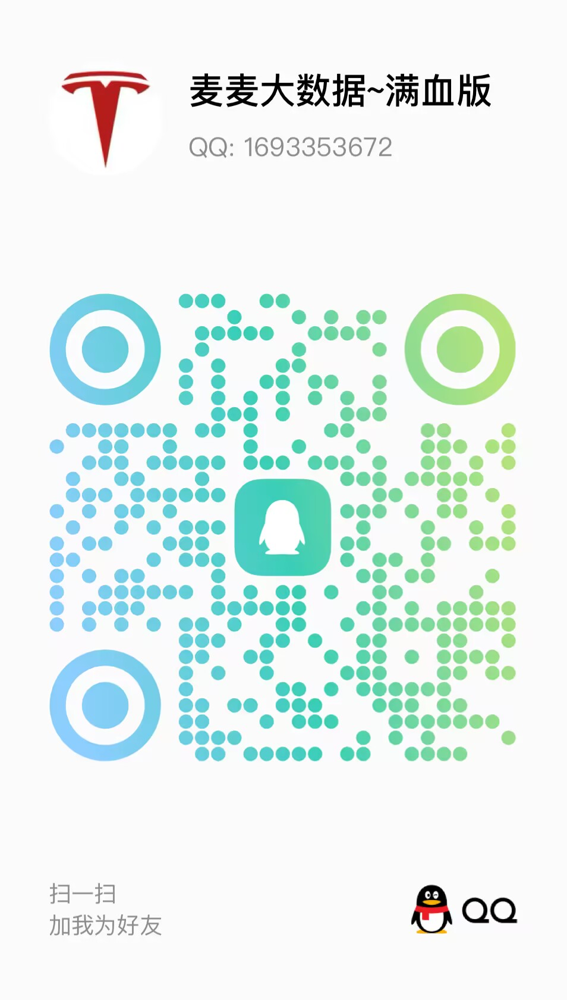

- 👋 Hi, 我是一个专注于算法+可视化的开发工程师（15年开发经验）
- 👀 我擅长的语言有  Vue、Java、Python
- 🌱 专业助攻计算机类毕设、比赛、大创等
- 🌱 擅长： 大数据 、 大模型 、 可视化 、 机器学习 、 算法等
- 🌱 团队情况： 90%的项目由麦麦本人亲自完成、团队成员来自中科大、西北工大、伊利诺伊香槟分校等。 
- 📫 怎么找到我
  - 
  - B站账号 《 麦麦大数据 》，欢迎关注我的B站： [前往](https://space.bilibili.com/1583208775)
  - CSDN博客：  [前往](https://blog.csdn.net/roccreed?type=blog)
  - 我的个人网站： [麦麦空间](http://www.coderobot.top)
---
## 联系方式

---
## 🍇 2025 项目案例  🔥🔥🔥🔥🔥
### 🍑 vue + flask类
- F001 [Vue+Flask旅游数据可视化大屏系统 前后端分离 大数据分析]() （)
- F002 [Vue+Flask 电影协同推荐可视化平台 前后端分离 大数据分析]() （)
- F004 [ 新闻可视化系统爬虫更新数据+ flask + mysql架构]() （)
- F043 [vue+flask天气预测可视化系统大数据+机器学习+管理端+爬虫+超酷界面+顶级可视化水平]() （)
- F061 [vue+flask大模型写诗诗词推荐与可视化系统](https://github.com/redcomet88/f061_poet) （混合推荐算法、大模型对话)
- F068 [vue+flask山西非遗文化遗产图谱可视化系统](https://www.bilibili.com/video/BV1LitbzbEpd) （知识图谱、可视化、文化类项目）
- F069 [vue+flask基于规则apiori算法的求职推荐系统]() ()
  
### 🍈 vue + django类
- D003 [vue+django 大模型心理学智能诊断评测系统干预治疗辅助系统、智慧心理医疗、带知识图谱]() (心理类、大模型、图谱)
- D010 [vue+Django农产品推荐与价格预测系统、双推荐+机器学习预测+知识图谱]()
- D011 pro [vue+django 大模型道路交通流量LSTM预测流量|大模型出行建议|图谱可视化系统](https://www.bilibili.com/video/BV1txMmzJEtm) （LSTM 深度学习预测、 大模型、 知识图谱、可视化）
- D020 [vue+Django海产品推荐与价格预测系统、双推荐+三种价格预测对比+知识图谱]()

### 🍉 vue + springboot类

--- 
## 学习教程
目前开了两个坑：

## 一、 Scrapy 爬取旅游景点相关数据 ⛩
基于流行的爬虫框架scrapy爬取旅游景点，涉及scrapy爬虫、中间件、管道
以及selenium读取动态网页、代理、指纹等技术的使用
- 教学视频：[点击](https://www.bilibili.com/video/BV1Vx4y147wQ)
- 课程讲义：[点击](https://blog.csdn.net/roccreed/article/details/140680833)

✅ 爬取日本景点数据 7000+ ，包含东京、大阪、横滨、札幌、名古屋、神户、京都、奈良等城市
✅ 爬取景点评论数据 40000+

 

## 二、从0开始 vue+flask 旅游景点数据分析系统 🏯
基于 element-ui + echarts + flask + mysql 搭建一个前后端分离的旅游景点数据分析系统
- 教学视频：[点击](https://www.bilibili.com/video/BV1gTveeZEbz)
- 课程讲义：[点击](https://blog.csdn.net/roccreed/article/details/140734085)

✅  从0开始搭建一个  vue + flask 的数据分析系统；
✅  了解系统的整体架构，前后端交互、 后端与数据库的交互方式；
✅  几种常用的 echarts 图形的如何使用；
✅  element-ui 搭建管理程序布局风格的系统；
✅  flask 后端框架作为服务端使用；
✅   推荐算法的集成（如果时间安排来得及的话）；

